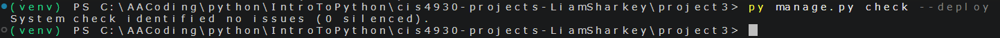

## Liam Sharkey lks24e

## Description
This is an attempt at a webite containing information about video games using a dataset from steam. I did not realize that projects 1 and 2 would be combined, so there is also functionality for weather tracking, though not useful.

## Dataset
https://www.kaggle.com/datasets/artermiloff/steam-games-dataset

## Application Features
-Can collect and store weather reports with py manage.py fetch_data
-Stores database of video game records, seeding with py manage.py seed_data
-Displays a home page, list of games, detailed view for each game, edit view for each game, and a delete button.

## Setup
-Clone repository 
-Run 
        -py manage.py makemigrations
        -py manage.py migrate
        -py manage.py flush
        -py manage.py seed_data
        -py manage.py runserver
-Open the url that the runserver command gives you in your browser of choice

## Screenshots

